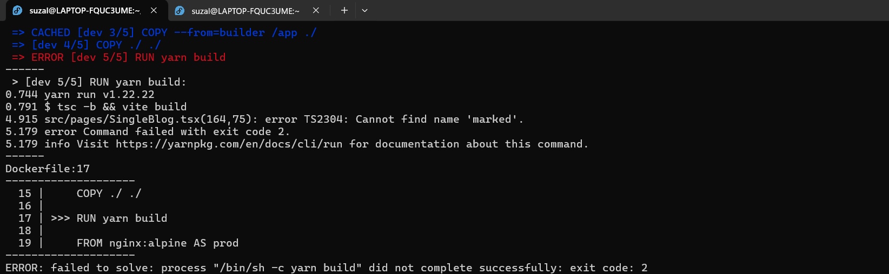

# Containerization II Assignment

## 1. Frontend Containerization

At first, I created a Dockerfile inside the frontend directory. I used node:18 as the base image and set the working directory to /app. Then, I used the COPY command to copy all the files from the frontend directory into the image’s working directory. After that, I ran yarn to install the dependencies and set the CMD to run yarn dev --host to allow access from outside the container.

 

After setting up the Dockerfile, I created a Docker network named app-network using the bridge driver so that containers could communicate internally. I then built an image from the frontend Dockerfile and ran the container by attaching it to the app-network, mapping the container’s port 5173 to my host’s port 5173 so that I could access the app via browser.

 
 

However, the image size turned out to be 1.81 GB, which was huge for a simple React frontend. To optimize this, I refactored the Dockerfile using multi-stage Docker builds. In the first stage (builder), I still used the heavier image to install dependencies like node_modules. Then in the second stage, I used a lightweight base image node:18-alpine and copied only the necessary files from the previous stage. I also copied the source code and ran yarn build to generate the production-ready dist/ folder.

In the final stage, I used nginx:alpine as the base image and copied the built dist directory from the second stage to /usr/share/nginx/html, which is the default path Nginx serves files from. I made sure the order of layers in the Dockerfile was optimized to leverage Docker's layer caching, I put the dependency install steps at the top so that frequent source code changes wouldn't trigger reinstalling packages again, saving build time and storage.

 

I also wrote a custom default.conf file to override the default Nginx config and make it listen on port 80.

 

After rebuilding the Docker image using the optimized multi-stage Dockerfile, I initially faced a TypeScript error due to unused declarations. After fixing the frontend code and successfully running yarn build, the final image size was reduced to just 48.9 MB, which was a massive improvement.

 
 
 

## 2. Database Containerization

For the backend, I started by running a PostgreSQL container using the official lightweight image postgres:17.5-alpine3.22. I used the following parameters in the docker run command: 
`--init --rm -d --name mydb --network app-network -e POSTGRES_USER=fellowship -e POSTGRES_PASSWORD=12345678 -e POSTGRES_DB=fellowship -p 5432:5432 postgres:17.5-alpine3.22`

Initially, the backend couldn’t connect to the database due to a misconfigured parameter. After fixing it, I reran the Postgres container with the correct config.

Then I edited the .env files in the backend project to match the values passed to the Postgres container

## 3. Backend Containerization

I proceeded to write a Dockerfile for both backend services. I followed the same structure as the frontend Dockerfile: used node:18-alpine for a lightweight base, copied package.json and yarn.lock first, installed dependencies with yarn, then copied the rest of the source files.

I originally included a step to run yarn migrate in the Dockerfile, but since database migration requires the backend container to be connected to the database at runtime (on the same network), it failed with an error saying the required client configuration was missing. So, I removed that layer from the Dockerfile and instead planned to run the migration manually after the container was up and running.

I also updated .dockerignore to exclude .env, node_modules, logs.log, Dockerfile, and other unnecessary files from being copied into the Docker image, which helped keep the image lightweight and secure.

Then, I ran the backend container on the same app-network, mapped ports based on what the code expected.

Once the backend container was running, I manually ran: `docker exec <backend-container-name> yarn migrate`

However, I encountered an ECONNREFUSED error at 127.0.0.1:5432. This was because the database hostname in .env was still set to localhost instead of mydb (which is the correct container name to use inside a Docker network). 

After fixing the hostname and confirming that the .env, ports, and credentials were consistent between both containers, the migration worked successfully.

Finally, I was able to open the fullstack application in my browser and see everything working end-to-end.

After that, I also edited the backend Dockerfile to use multi-stage build similar to the frontend where I used a builder stage to install dependencies and compile the code, and then used a final stage just for running the production-ready app. I used the same node:18-alpine as the base image in both stages. This helped me reduce the final backend image size from 270MB down to 190MB, making it cleaner and more efficient for deployment.

